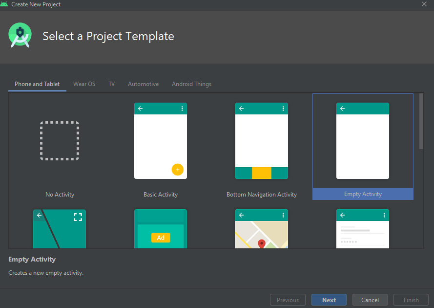
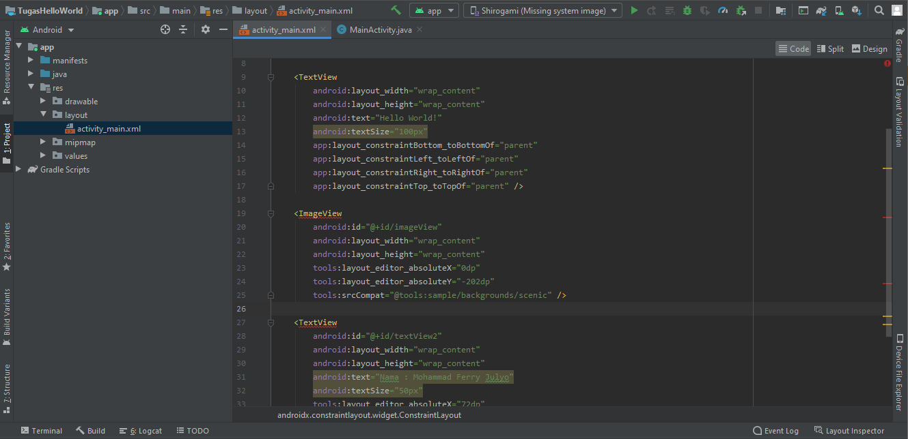

# Laporan Praktikum #2 - Layout

 

## Tujuan Pembelajaran

Setelah menempuh materi percobaan ini, mahasiswa mampu mengenal:
1. Mahasiswa mampu membuat project pada Android Studio.
1. Mahasiswa lebih mengenal Android Stuio.

## Praktikum

### Pembuatan Project

1. 	Buka Android Studio dan pilih Empty Activity.

	 
	
2. 	Atur project seperti gambar dibawah.
	
	 

3. 	Lalu buka activity_main.xml
	
	 

4.	Atur Design sesuai yang kalian inginkan dengan drag n drop dan juga pada xml editor.
	
	 
	 

5. 	Setelah itu sambungkan USB(Debugging) dan klik #Run#.

	 

6. 	Hasil akhir project akan seperti gambar dibawah.
	
	  

### Mohammad Ferry Julyo, 2020