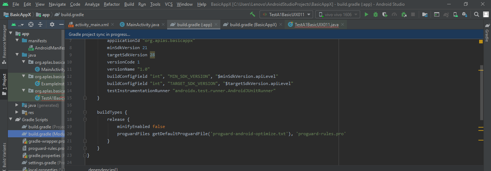
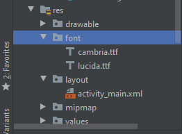
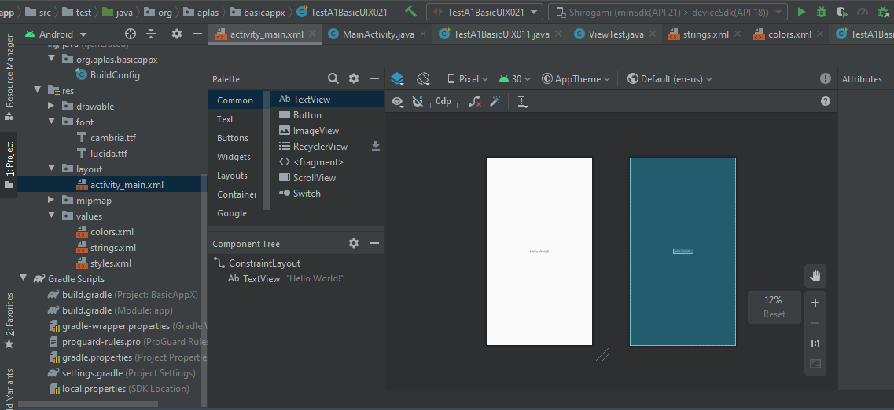
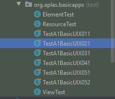

# Laporan Praktikum #2 - Layout

## Tujuan Pembelajaran

Setelah menempuh materi percobaan ini, mahasiswa mampu mengenal:
1. Mahasiswa memahami konsep layout pada android.
2. Mahasiswa memahami konsep View Group dan Hierarchy pada layout.
3. Mahasiswa mampu membuat layout sederhana
4. Mahasiswa menguasai layout editor dan kegunaannya pada android studio.

## Praktikum

### Pembuatan Project

1. Pertama, jalankan android studio, setelah itu terdapat pilihan pilih new project,kemudian pilih empty activity

2. Kemudian atur konfigurasi project seperti dibawah. 
	a)Name: BasicAppX  
	b)Package name: org.aplas.basicappx  
	c)Save Location: any  
	d)Language: Java  
	e)Minimum API Level: API 21/Android 5.0 Lollipop  
	f)This project will support instant apps: Uncheck  
	g)Use android.* artifacts: Check  
   
  
### Task Guide 1

1. Ubah isi file build.gradle pada module:app sesuai pada module kemudian klik **sync gradle**

    
    

2. Delete ExampleUnitTest di org.aplas.basicapp dan copy file test dan lainnya kedalam folder, kemudian jalankan TestA1BasicUIX011

    
    

  
### Task Guide 2

1. Buatlah folder font dalam direktori res, dan atur nama dan resource menjadi font

	 

2. masukan file font kedalam folder font

    

3. Atur file string di folder res/values seperti di bawah ini

    

4. Atur file color di folder res/values seperti di bawah ini

    
   
5. Jalan kan file TestA1BasicUIX021

	 
	 
  
### Test Guide 3

1. Buka activity_main.xml

	 

2. Buatlah RelativeLayout dengan id mainLayout, dengan TextView(myTextView) dan Button(convertButton) didalamnya.
	
	 
		
3. Pada xml editor, atur seperti yang ada pada modul.
		
	 

4. Hasil akhir tampilannya akan seperti gambar dibawah.
			
	 
	
5. Kemudian jalankan TestA1BasicUIX031.
			
	 
	 
  
### Test Guide 4

1. Tambahkan space(space1) dan LinearLayout Horizontal(child1) pada mainLayout.

	 
	
2. Pada xml editor, atur seperti yang ada pada modul.	

	 

3. Kemudian jalankan TestA1BasicUIX041.
		
	 		
	 
				
				
  
### Test Guide 5

1. Buka strings.xml dan tambahkan beberapa value seperti yang ada pada modul.

	 

2. Lalu didalam child1, tambahkan EditText(inputText), Spinner(oriList), TextView(myTextView2), EditText(outpurText), Spinner(convList).
	
	 

3. Pada xml editor, atur seperti yang ada pada modul.
	
	 
	
4. Kemudian jalankan TestA1BasicUIX051 dan TestA1BasicUIX052.	

	 
	 
	 

  
### Test Guide 6

1. Dibawah child1, tambahkan LinearLayout(child2) dan didalam child2 tambahkan CheckBox(chkRounded) dan CheckBox(chkFormula).

	 
	
2. Pada xml editor, atur seperti yang ada pada modul.

	 
	
3. Kemudian jalankan TestA1BasicUIX061.
	
	 
	 
  
### Test Guide 7

1. Dibawah child2, tambahkan RadioGroup(radioGroup) dengan 3 RadioButton didalamnya, masing-masing dengan id("rbTemp","rbDist",dan "rbWeight").

	 
	
2. Pada xml editor, atur seperti yang ada pada modul.
	
	 
	
3. Kemudian jalankan TestA1BasicUIX071.	

	 
	 
  
### Test Guide 8

1. Copy file "temperature.jpg" pada folder drawable.

	 

2. Dibawah radioGroup, tambahkan ImageView(img).	
	
	 

3.	Pilih image "temperature.jpg"

	 

4. 	Pada xml editor, atur seperti yang ada pada modul.

	 
	
5. Kemudian jalankan TestA1BasicUIX081 dan TestA1BasicUIX082.	
	
	 
	 
  
### Test Guide 9

1. Copy file "cell_style.xml" dan “header_style.xml” pada folder drawable.

	 

2. 	Dibawah ImageView(img), tambahkan TableLayout(table) dan 3 TableRow didalamnya dengan masing-masing memiliki id("tv11","tv21",dan "tv31") 
dan tambahkan 3 TextView didalam masing-masing TableRow.
 
	 

3. 	Pada xml editor, atur seperti yang ada pada modul.
	
	 

5. Kemudian jalankan TestA1BasicUIX091 dan TestA1BasicUIX092.
	
	 
	 
  
### Hasil

1. Jika sudah menjalankan semua guide build aplikasi(emulator/install via usb)

     

### Mohammad Ferry Julyo, 2020