# Laporan Praktikum #2 - Layout

 

## Tujuan Pembelajaran 

Setelah menempuh materi percobaan ini, mahasiswa mampu mengenal:
-

## Praktikum

### Pembuatan Project

### Task Guide 1

   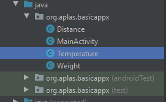 
   
   
    

   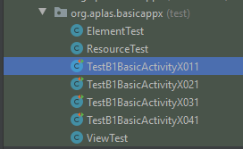 
   
   
    

  
### Task Guide 2

	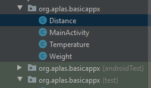 

   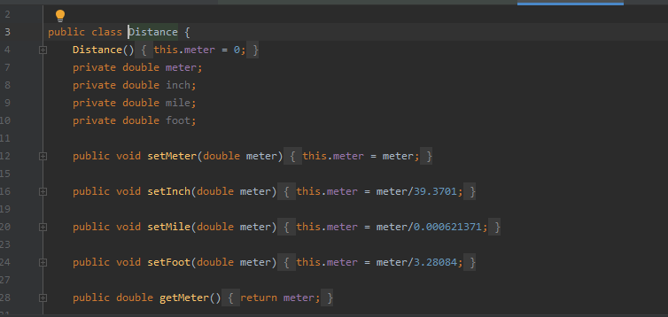 

   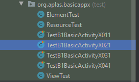 

   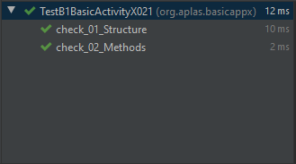 
   
   
  
### Test Guide 3

	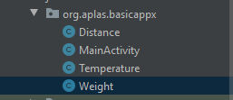 

	
	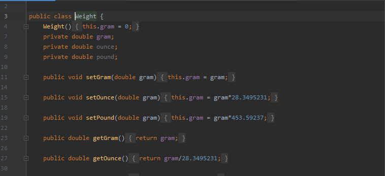 
		
		
	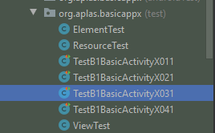 

			
	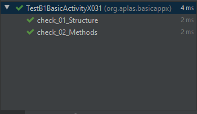 
	

  
### Test Guide 4

	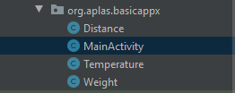 
	

	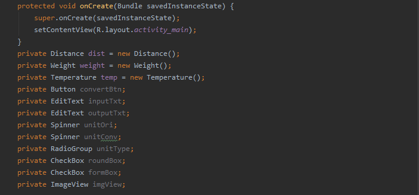 

		
	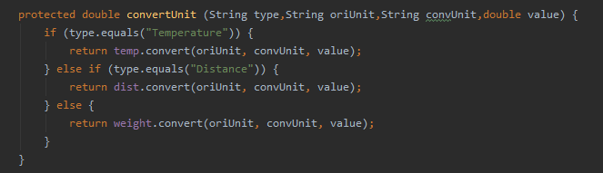 		
	
	
	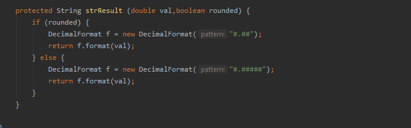 
				

	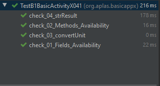 

	
  
### Test Guide 5

	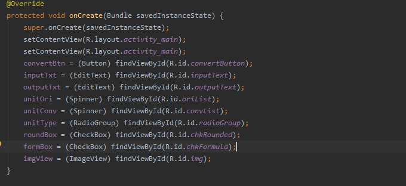 

	
	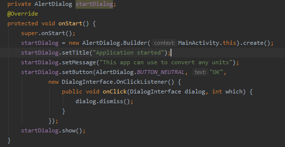 

	
	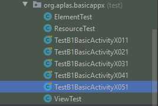 
	

	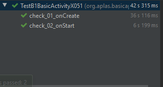 

  
### Test Guide 6

	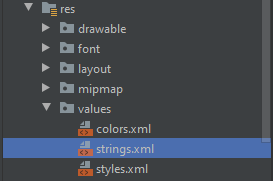 
	

	 
	
	
	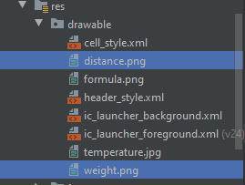 
	
	
	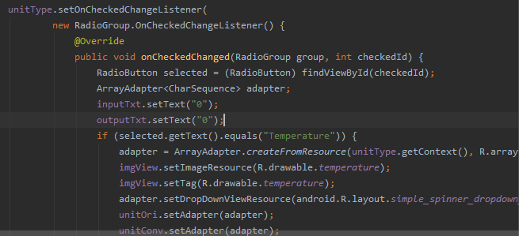 
	
	
	 
	
	
	 
	
	
  
### Test Guide 7

	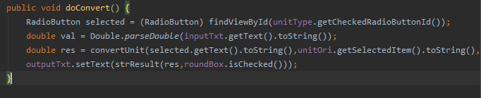 
	
	
	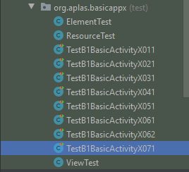 
	

	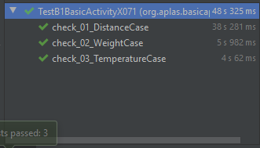 

  
### Test Guide 8

	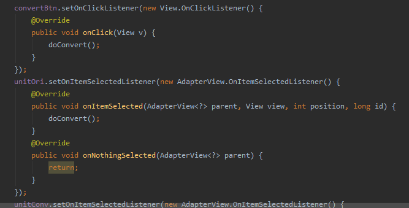 

	
	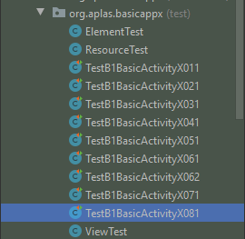 

	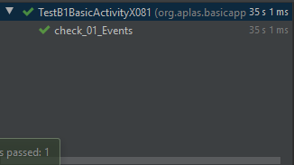 
	
	
  
### Test Guide 9

	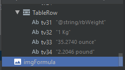 

	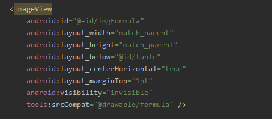 

	
	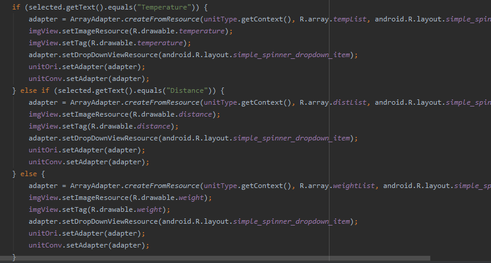 

  
### Hasil

     

### Mohammad Ferry Julyo, 2020