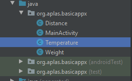
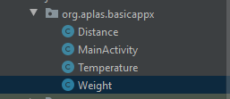
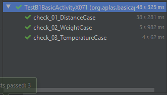

# Laporan Praktikum #3 - Basic Activity

 

## Tujuan Pembelajaran

Setelah menempuh materi percobaan ini, mahasiswa mampu mengenal:
1. Mahasiswa memahami konsep dasar activity pada android.
2. Mahasiswa mampu membuat activity pada android.

## Praktikum

### Pembuatan Project

1. Pertama, jalankan android studio.  

2. Kemudian buka project BasicAppX yang telah kita buat sebelumnya.
   
  
### Task Guide 1

1. Buatlah file baru dengan nama **Temperature** pada folder **org.aplas.basicappx**

    

2. Masukkan perintah pada **Temperature** sesuai seperti yang ada pada jobsheet.  

    

3. Jalan kan file TestB1BasicUIX011

	 
	 

  
### Task Guide 2

1. Buatlah file baru dengan nama **Distance** pada folder **org.aplas.basicappx**

    

2. Masukkan perintah pada **Distance** sesuai seperti yang ada pada jobsheet.  

    

3. Jalan kan file TestB1BasicUIX021

	 
	 
	
  
### Test Guide 3

1. Buatlah file baru dengan nama **Weight** pada folder **org.aplas.basicappx**

    

2. Masukkan perintah pada **Weight** sesuai seperti yang ada pada jobsheet.  

    

3. Jalan kan file TestB1BasicUIX031

	 
	 

  
### Test Guide 4

1. Buka **MainActivity**

    

2. Buatlah field sesuai yang ada pada Jobsheet.   

    
   
3. Buatlah Method **convertUnit** dan **strResult** sesuai yang ada pada jobsheet.   

    
    

4. Jalan kan file TestB1BasicUIX041

	 	
				
  
### Test Guide 5

1. Masih pada **MainActivity** pada method **onCreate** masukkkan code agar dapat memenuhi **Requirement** yang ada pada jobsheet seperti gambar dibawah.

    

2. Dan pada method **onStart** masukkkan code agar dapat memenuhi **Requirement** yang ada pada jobsheet seperti gambar dibawah.   

    
   
3. Jalan kan file TestB1BasicUIX051

	 
	 		

  
### Test Guide 6

1. Buka file **string.xml**.

    

2. Lalu masukkan Value sesuai dengan yang ada pada jobsheet.   

    
   
3. Copy file **distance.png** dan **weight.png** pada folder **drawable**.   

    

4. Buka **MainActivity** lalu masukkan perintah pada RadioGroup didalam Method **onCreate** agar memenuhi permintaan pada jobsheet.   

    
   
5. Copy file **ElementTest** dan **ResourceTest** kemudian jalan kan file TestB1BasicUIX061

	 
	 

  
### Test Guide 7

1. Buatlah method **doConvert** sesuai Requirement yang ada pada jobsheet.

    
   
2. Jalan kan file TestB1BasicUIX071

	 
	 

  
### Test Guide 8

1. Buatlah Event Listener dibawah **unitType.setOnCheckedChangeListener** didalam method **onCreate**.

    
   
2. Jalan kan file TestB1BasicUIX081

	 
	 

  
### Test Guide 9

1. pada **activiity_main** buat sebuah **ImageView** dengan ketentuan seperti yang ada pada Jobsheet.

    

2. Atur dengan ketentuan seperti yang ada pada jobsheet.

    
    
3. Jalan kan file TestB1BasicUIX091

	 
	 

  
### Hasil

1. Jika sudah menjalankan semua guide build aplikasi(emulator/install via usb)

     
     
     
     
     
     
     

### Mohammad Ferry Julyo, 2020