# Laporan Praktikum #3 - Basic Activity

 

## Tujuan Pembelajaran

Setelah menempuh materi percobaan ini, mahasiswa mampu mengenal:
1. Mahasiswa memahami style, tema, dan drawable vector image
2. Mahasiswa mampu membuat UI dari atribut melalui onClick 
3. Mahasiswa memahami cara kerja CountDown timer
4. Mahasiswa memahami cara kerja timer untuk memulai game
5. Mahasiswa memahami cara akses array dan menggunakannya pada List

## Praktikum

### Pembuatan Project

1. Pertama, buka android studio lalu buatlah project baru dan pilih **Add No Activity**.  

2. Setting project dengan ketentuan seperti dibawah. 
-Project Name: ColorGameX 
-Package Nam: org.aplas.colorgamex 
-Project Location: any 
-Language: Java 
-Target API Level: Android 5.0(Lollipop) 
-Support instant apps: uncheck 
-AndroidX: check 
   
  
### Task Guide 1

1. Buka **colors.xml** dan atur dengan ketentuan seperti pada modul.

   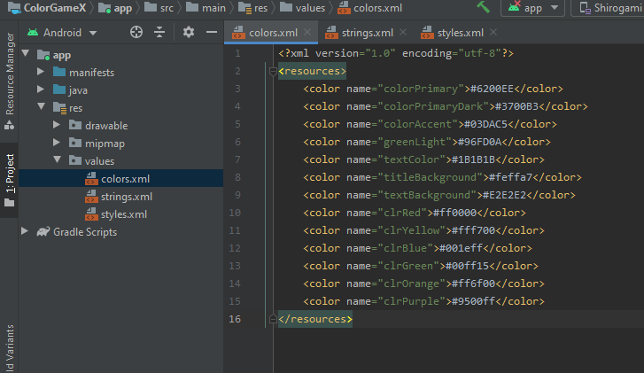 

2. Atur juga file **strings.xml**.  

   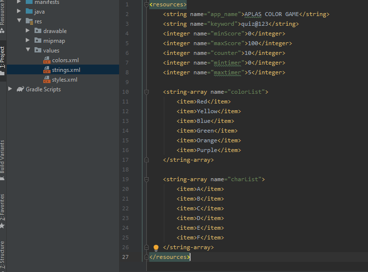 

3. Dan **styles.xml**.  

   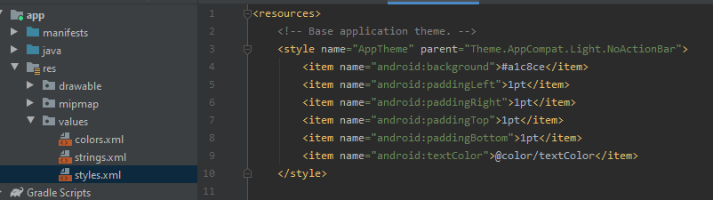 

4. Kemudian buatlah sebuah **Empty Activity** pada **org.aplas.colorgames** dengan ketentuan seperti pada modul.  

   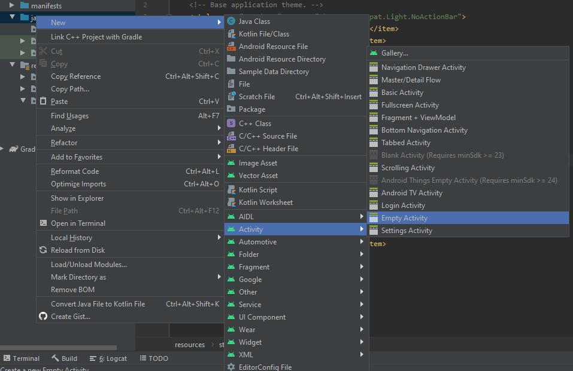 
   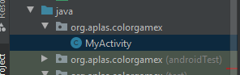 
 
5. Buka **AndroidManifest** dan atur dengan ketentuan seperti pada modul.  

   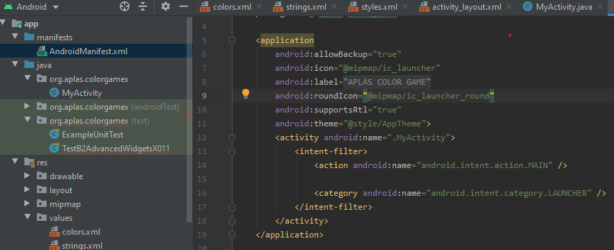 
 
6. Buka **buil.gradle(Module: app)** dan atur dengan ketentuan seperti pada modul.  

   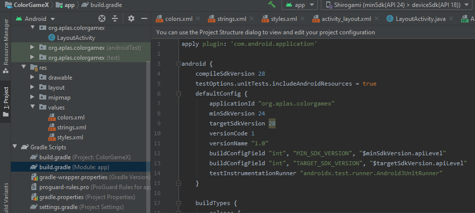 
   
7. Sync gradle dengan project, setelah selesai jalankan file TestB2BasicUIX011 dan TestB2BasicUIX012.

	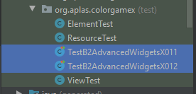 
	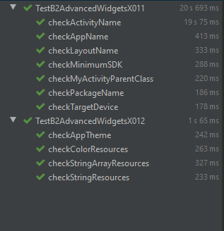 

  
### Task Guide 2

1. Copy file **ic_launcher.xml(v24)** kedalam folder **drawable**.

   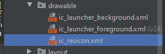 

2. Kemudian buatlah sebuah **Drawable Resource File**.  

   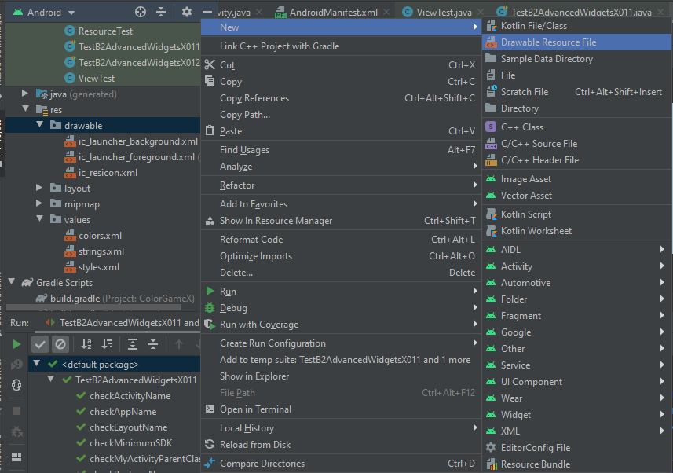 

3. Atur seperti gambar dibawah.  

   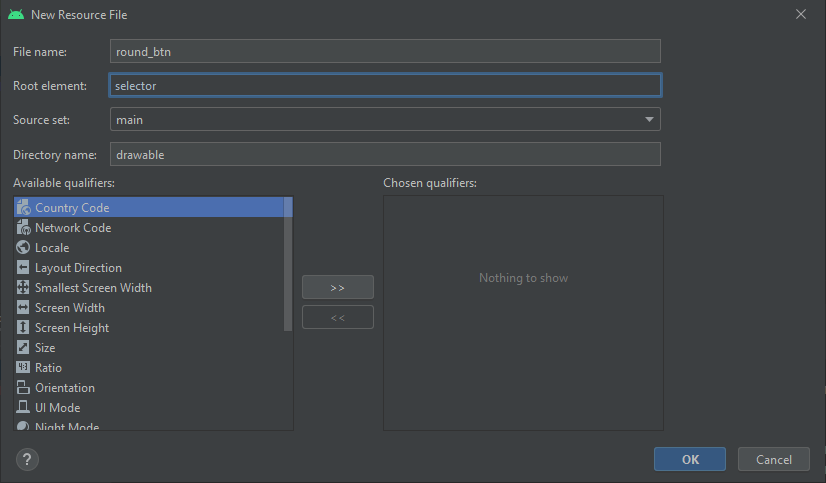 

4. Tambahkan beberapa attribute unduk mendefinisikan bentuk dari **round_btn**.  

   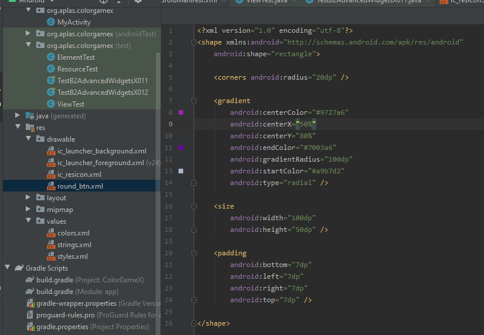 

5. Tambahkan beberapa code pada file **styles.xml**.  

   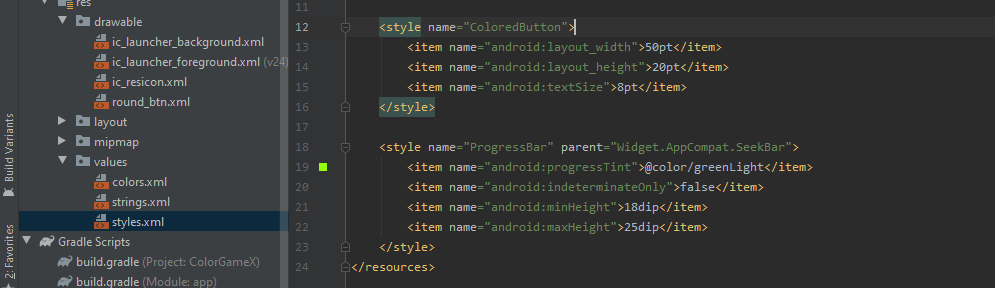 
    
3. Jalan kan file TestB2BasicUIX021

	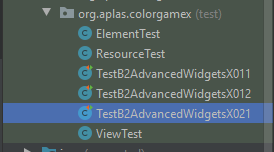 
	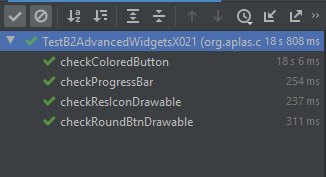 
	
  
### Test Guide 3

1. Buka **activity_layout** dan atur dengan ketentuan seperti pada modul.

   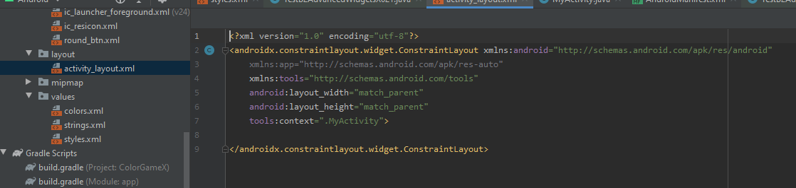 

2. Tambahkan 3 method pada **MyActivity.java**.  

   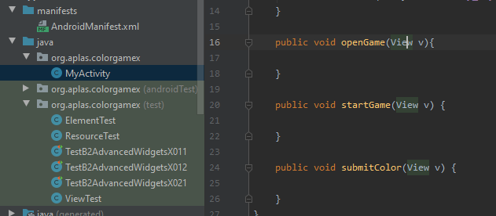 

3. Pada xml editor atur isi dari **activiity_layout** dengan ketentuan seperti pada modul.  

   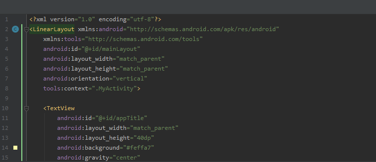 

4. Tampilan dari UI akan seperti gambar dibawah.  

   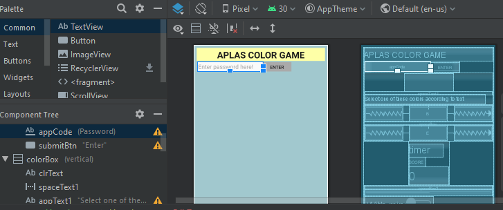 

5. Jalan kan file TestB2BasicUIX031

	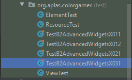 
	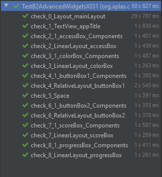 

  
### Test Guide 4

1. Deklarasikan beberapa field pada **MyActivity**.

   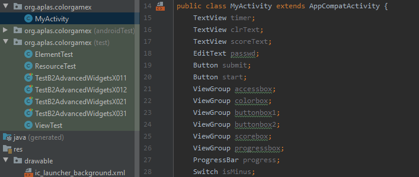 

2. Tetapkan setiap field dengan source yang terkait di method **onCreate**.   

   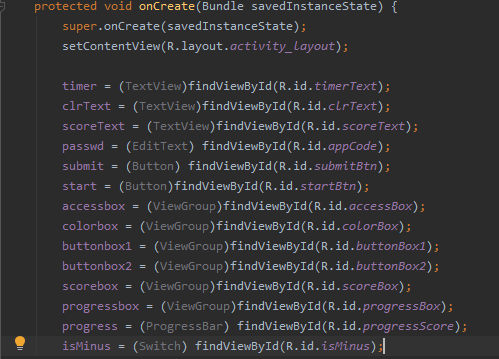 
   
3. Atur method **openGame** dengan ketentuan seperti pada modul.   

   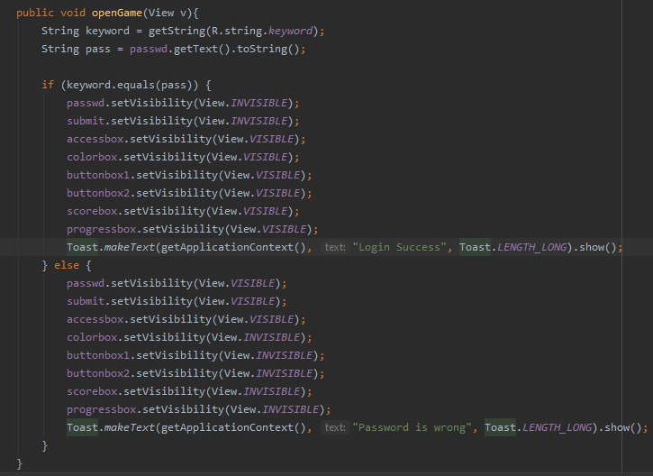    

4. Jalan kan file TestB2BasicUIX041

	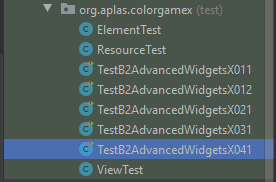 	
	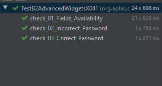 	
				
  
### Test Guide 5

1. Tambahkan field baru pada **MyActivity**.

   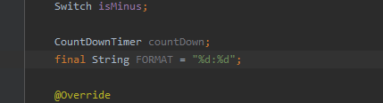 

2. Atur **initTimer** dengan ketentuan seperti pada modul.   

   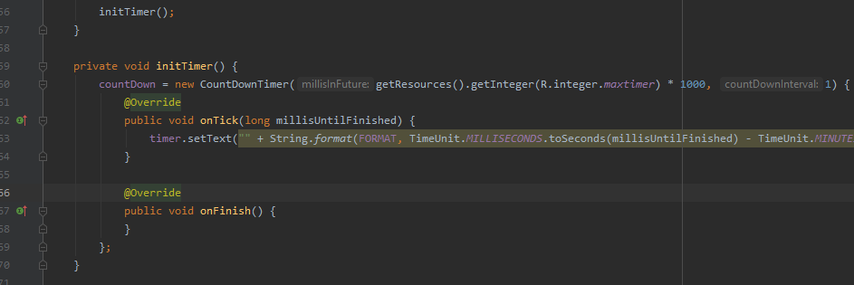 
   
3. Jalan kan file TestB2BasicUIX051

	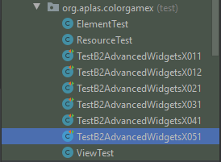 
	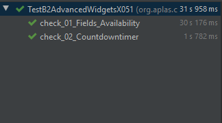 		

  
### Test Guide 6

1. Tambahkan field baru pada **MyActivity**.

   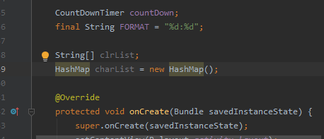 

2. Buat method **initColorList** dan atur dengan ketentuan seperti pada modul.   

   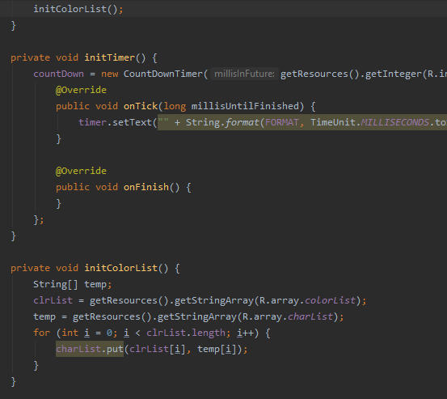 
   
3. Copy file **ElementTest** dan **ResourceTest** kemudian jalan kan file TestB2BasicUIX061

	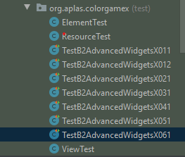 
	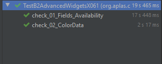 

  
### Test Guide 7

1. Tambahkan field baru pada **MyActivity**.

   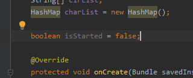 
 
2. Buatlah method baru dengan nama **getNewRandomInt** seperti ambar dibawah.

   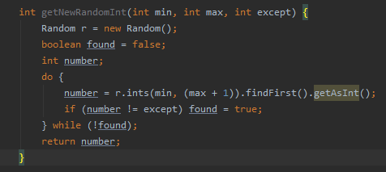 
   
3. Buat method **newGameStage** dan atur dengan ketentuan seperti pada modul.

   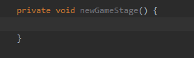 
   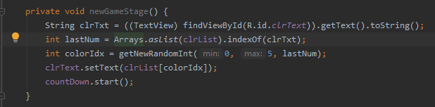 
   
4. Atur method **startNewGame** dengan ketentuan seperti pada modul.

   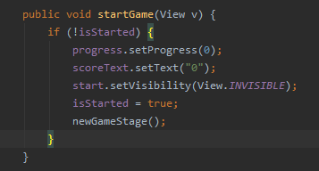 
 
2. Jalan kan file TestB2BasicUIX071

	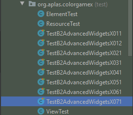 
	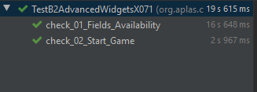 

  
### Test Guide 8

1. Buat private method dengan nama **updateScore** dan atur dengan ketentuan seperti pada modul.

   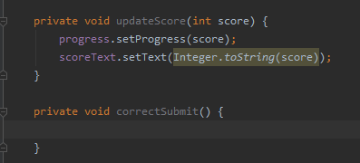 

2. Buat juga private method dengan nama **correctSubmit** dan atur dengan ketentuan seperti pada modul.

   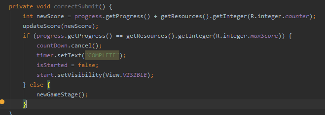 

3. Buat 1 private method lagi dengan nama **wrongSubmit** dan atur dengan ketentuan seperti pada modul.

   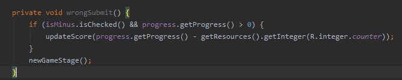 

4. Atur method **submitColor** dengan ketentuan seperti pada modul.

   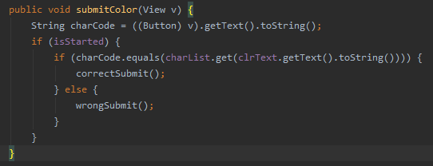 
   
2. Jalan kan file TestB2BasicUIX081

	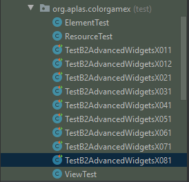 
	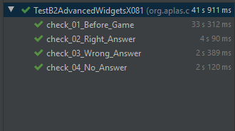 

  
### Hasil

1. Jika sudah menjalankan semua guide build aplikasi(emulator/install via usb)

   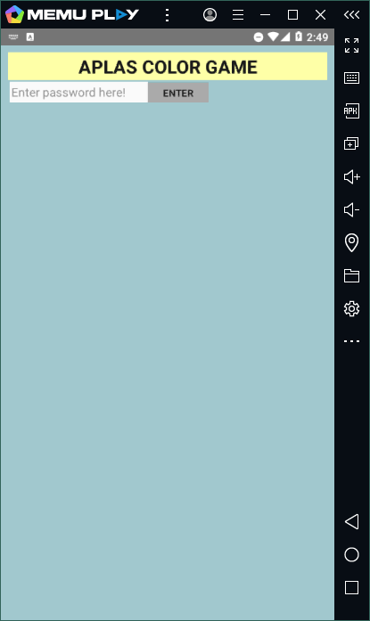  
   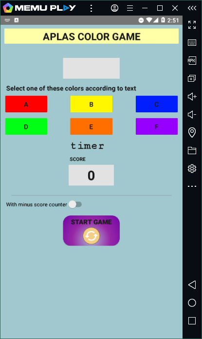  
     
     

### Mohammad Ferry Julyo, 2020