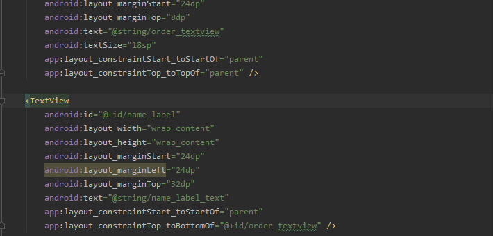

# Laporan Praktikum #5 - Scrollview

 

## Tujuan Pembelajaran

Setelah menempuh materi percobaan ini, mahasiswa mampu mengenal:
1. Mahasiswa mengerti bagaimana cara menggunakan kode XML untuk menambahkan beberapa elemen TextView.
2. Mahasiswa mengerti bagaimana cara menggunakan kode XML untuk menentukan tampilan bergulir.
3. Mahasiswa mengerti bagaimana cara menampilkan teks bentuk bebas dengan beberapa tag pemformatan HTML.
4. Mahasiswa mengerti bagaimana memberi gaya pada warna latar belakang TextView dan warna teks.
5. Mahasiswa mengerti bagaimana cara memasukkan tautan web ke dalam teks.

## Praktikum

### Pembuatan Project

1. Pertama, buka android studio lalu buatlah project baru dan pilih **Add Blank Activity**.  

2. Setting project dengan ketentuan seperti dibawah. 
   
    
   
  
### Task : 1 Add and edit TextView Elements

1. pada xml editor, buatlah sebuah **TextView** dengan ketentuan seperti pada tutorial.

    

2. Atur file **strings.xml** seperti gambar dibawah.  

    

3. Buatlah file **dimens.xml** dengan cara meng-extract(alt+enter) pada **android:padding** yang awalnya **10dp**.  

    

4. Atur **colors.xml**(optional).  

    

  
### Task : 2 Add a ScrollView and an active web link

1.  Tambahkan attribute **autoLink** untuk menentukan link web.

    

2. Tambahkan sebuah **ScrollView** diantara heading dan subheading.  

    
	
  
### Task : 3 Scroll multiple elements

1.  Tambahkan sebuah **LinearLayout** didalam **ScrollView** dengan ketentuan seperti pada tutorial.

    

2. Hasil akhir aplikasi akan terlihat seperti gambar dibawah.  

    

  
### Challenge and Homework

1. Tambahkan Button pada akhir artikel(dibawah TextView terakhir).

    

2. Ubah **LinearLayout** `android:orientation` menjadi **Horizontal**.

    

3. Ubah juga TextView(subheading) `android:layout_width` menjadi **100dp**.   

    
   
3. Tampilan aplikasi akan menjadiseperti gambar dibawah.   

    
        
				
  
### Hasil

1. Jika sudah menjalankan semua guide build aplikasi(emulator/install via usb)

     
     
   
   
### Question

Question 1

How many views can you use within a ScrollView? Choose one:

    -One view only
    -One view or one view group
    -As many as you need

Jawab : **Scrollview hanya dapat memiliki 1 child.**
    

Question 2

Which XML attribute do you use in a LinearLayout to show views side by side? Choose one:

    -android:orientation="horizontal"
    -android:orientation="vertical"
    -android:layout_width="wrap_content"

Jawab : **android:orientation="horizontal"**

Question 3

Which XML attribute do you use to define the width of the LinearLayout inside the scrolling view? Choose one:

    -android:layout_width="wrap_content"
    -android:layout_width="match_parent"
    -android:layout_width="200dp"

Jawab : **android:layout_width="match_parent"**

### Mohammad Ferry Julyo, 2020