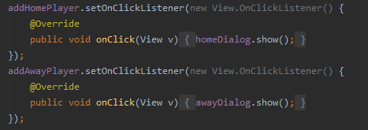
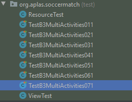
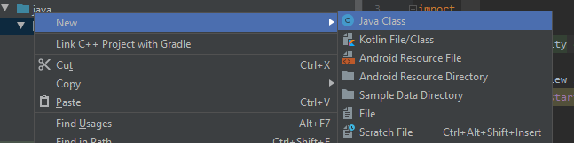
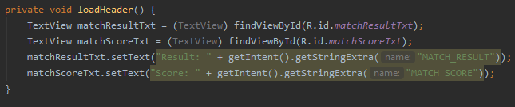
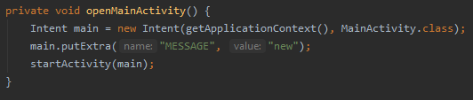

# Laporan Praktikum #8 - Soccer Match

 

## Tujuan Pembelajaran

Setelah menempuh materi percobaan ini, mahasiswa mampu mengenal:
1. Mahasiswa mengerti apa itu Data binding.
2. Mahasiswa mengerti cara kerja Data binding.
3. Mahasiswa dapat melakukan Data Binding pada project android studio.

## Praktikum

### Task : 1 

1. . 
   
    

2. .

    

3. .  

    

    

    

  
### Task : 2 

1.  .

    

2. .  

    

    

    

	
  
### Task : 3 

1.  .

    

2. .  

    

    

    

    

    

    

    

    

    

    

  
### Task : 4 
1. .   
    

    

    

    

    

    

  
### Task : 5
1. .   
    

    

    

    

    

    

    

  
### Task : 6
1. .   
    

    

    

    

    

    

    

    

    

    

    

    

    

    

  
### Task : 7
1. .   
    

    

    

    

    

    

    

    

    

    

    

    

    

    

    

    

    

  
### Task : 8
1. .   
    

    

    

    

    

    

    

    

    

    

    

    

    

    

    

    

    

				
  
### Hasil

1. Jika sudah menjalankan semua guide build aplikasi(emulator/install via usb)

    

    

    

    

    

    

    

    
   

   
   

### Mohammad Ferry Julyo, 2020