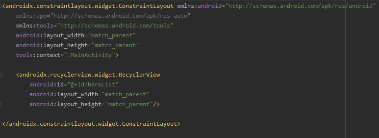
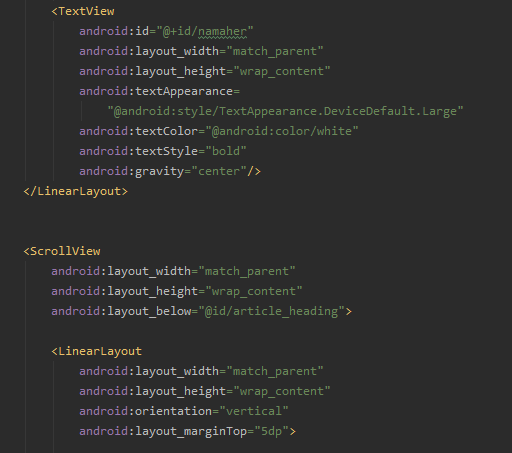
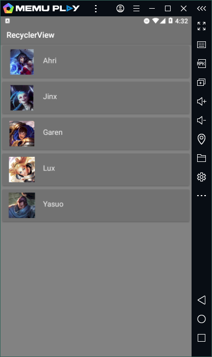
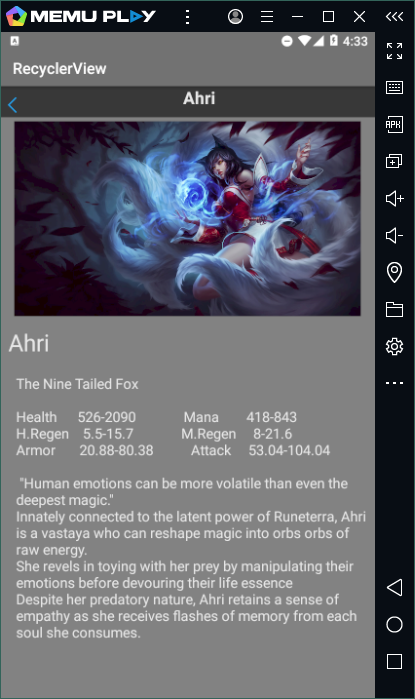

# Laporan Praktikum #10 - Recycler View

 

## Tujuan Pembelajaran

Setelah menempuh materi percobaan ini, mahasiswa mampu mengenal:
1. Mahasiswa mengerti apa itu Recycler View.
2. Mahasiswa mengerti cara kerja Recycler View.
3. Mahasiswa dapat mengimplementasikan Recycler View pada project android studio.

## Praktikum

### Task : 1 

1. . 
   
    

      

    

    

    

    

    

    

    

    

    
   
    
   
    

    

				
  
### Hasil

1. Jika sudah menjalankan semua guide build aplikasi(emulator/install via usb)

    

    

   

   
   

### Mohammad Ferry Julyo, 2020