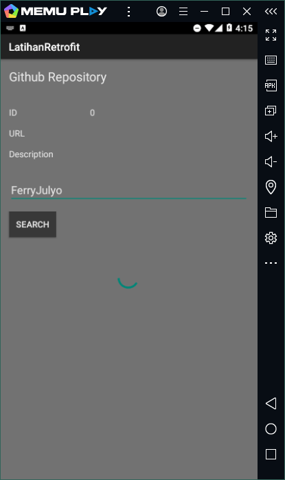

# Laporan Praktikum #11 - Retrofit

 

## Tujuan Pembelajaran

Setelah menempuh materi percobaan ini, mahasiswa mampu mengenal:
1. Mahasiswa mampu mengonfigurasi Retrofit pada android.
2. Mahasiswa mampu membuat request ke RESTful API menggunakan Retrofit.

## Praktikum

### Task : 1 

1. . 
   
    

      

    

    

    

    

    

    

    

   

				
  
### Hasil

1. Jika sudah menjalankan semua guide build aplikasi(emulator/install via usb)

    

    

    

   

   
   

### Mohammad Ferry Julyo, 2020