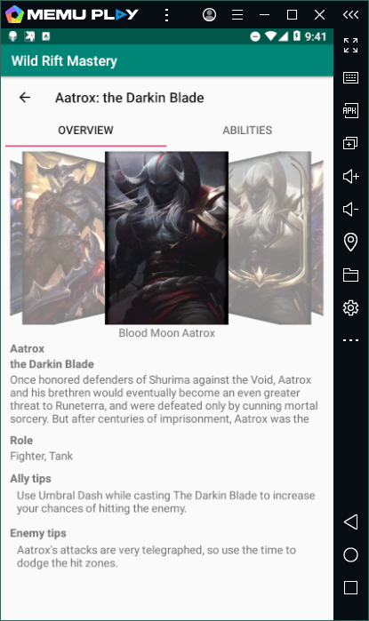

# Laporan Project Akhir # 

 

# Nama Aplikasi #

## Wildrift Mastery ##

Link Apk : https://github.com/FerryJulyo/Mobile_3D_19/tree/master/doc/99_WildRiftMastery/apk 

Link Source Code : https://github.com/FerryJulyo/Mobile_3D_19/tree/master/src/99_WildRiftMastery 

Bahasa Pemrograman : Java 

  

# Deskripsi Aplikasi #

Aplikasi yang saya buat adalah sebuah aplikasi yang berguna untuk mempermudah user/player 
mengetahui detail dari champion/hero di League of Legends : Wild Rift.  

User dapat mengetahui berbagai hal mulai dari hal dasar tentang hero tersebut seperti background  
dan julukan dari hero tersebut, juga hal-hal lain seperti Tips saat berhadapan dengan hero tersebut,  
atau tips saat hero tersebut menjadi kawan dalam game, juga terdapat deskripsi skill dari hero tersebut 
lengkap dengan ikon skill dan cooldown dari skill tersebut.

  

# Indentitas Pengembang (Developer) #

Nama : Mohammad Ferry Julyo  
NIM : 1941723008  
Kelas : TI-3D  

# Fitur-fitur Aplikasi #

1. Splash Screen

     

    Fitur splash screen yang menampilkan logo dari aplikasi, sebelum melanjutkan ke menu utama.  

2. Menu Utama

     

    Menu utama terdiri dari 3 menu yaitu Menu champion, info, dan about us.

3. Info Aplikasi

     

    Pada menu info terdapat informasi tentang aplikasi.

4. Info Developer

     

    Pada menu about us terdapat informasi tentang developer.

5. List Champion

     

    Pada menu champion terdapat tampilan dari champion yang ada pada game.

6. Fitur Search

     

    Fitur pencarian champion.

7. Detail Champion

     

    Menampilkan detail dari champion seperti backstory, role dan tips.

     

    Menampilkan detail skill/ability dari champion.

# Saran #

Aplikasi yang saya buat hanya mencakup tentang detail dari hero League of Legends : Wild Rift, 
jadi informasi tentang game hanya terbatas pada hero yang ada saja, jadi informasi yang lain berupa 
equipment, maupun meta, belum terdapat pada aplikasi ini.
  

# Kesimpulan #

Kesimpulan yang saya dapatkan dari pembuatan aplikasi WildRift Mastery ialah :

1. Dapat membuat aplikasi android sendiri 

2. Dapat menyalurkan hobi dalam bermain game ke dalam kegiatan perkuliahan 

3. Mendapatkan wawasan baru dalam pengembangan aplikasi android baik dari kampus maupun dari pihak luar 

4. Terdapat beberapa masalah dalam pembuatan project karena masih awam dalam pemrograman android  

# Sumber Data/Referensi #

1. Riot Api  
http://ddragon.leagueoflegends.com/cdn/10.25.1/data/en_US/champion.json 

2. Referensi :  
    - Youtube :  
    https://www.youtube.com/channel/UC_Fh8kvtkVPkeihBs42jGcA 
    https://www.youtube.com/channel/UCllewj2bGdqB8U9Ld15INAg 

    - Aplas 

    - developer.android.com 

    - codelabs 

    - dosenhub 

   

### Mohammad Ferry Julyo, 2020