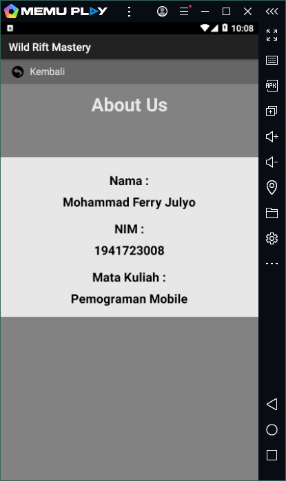
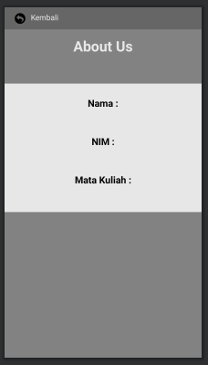

# Laporan Kuis # 2

 

### Splash Screen

1. . 
   
    

  
### Navigation and Data Binding

1. . 
   
    

    

  
### Without Data Binding

1. . 
   
    

				
  
### Task : 2

Perbedaan data binding dengan view model adalah data binding memungkinkan mengikat komponen UI dalam tata letak ke sumber data di aplikasi menggunakan format deklaratif, bukan secara terprogram. Dengan mengikat komponen dalam file tata letak dapat menghapus banyak panggilan framework UI dalam aktivitas,yang menjadikannya lebih sederhana dan lebih mudah dikelola. 
 
Data binding dan view model digunakan ketika untuk menyimpan dan mengelola data terkait UI. 
Reference : modul library binding

  
### Task : 3
   
Fragment merupakan bagian dari sebuah activity yang mana sebuah fragment tidak akan ada bila tidak ada sebuah activity karena fragment membutuhkan akses dari activity untuk dapat dijalankan. 
Salah satu perbedaan utama antara activity dan fragment adalah bahwa ketika activity berada dalam status di background, activity tersebut ditempatkan dalam tumpukan di bawah. Hal ini memungkinkan suatu activity untuk dilanjutkan kembali (resume) ketika user menekan tombol 'Back'. Sebaliknya fragment tidak otomatis ditempatkan di tumpukan bawah ketika berada dalam status background. 

Kita bisa menggunakan activity untuk menampilkan user interface (UI), melakukan berbagai kegiatan yang diperlukan di dalam aplikasi tersebut seperti berpindah dari satu tampilan ke tampilan lainnya, menjalankan program lain, dll 
Reference : https://socs.binus.ac.id/2017/09/26/activity-dan-fragment-di-android-studio/#:~:text=Fragment%20merupakan%20bagian%20dari%20sebuah,dari%20activity%20untuk%20dapat%20dijalankan. 
https://www.jodemy.com/2018/03/tanya-jawab-activity-fragment-dan-intent.html

   
   

### Mohammad Ferry Julyo, 2020